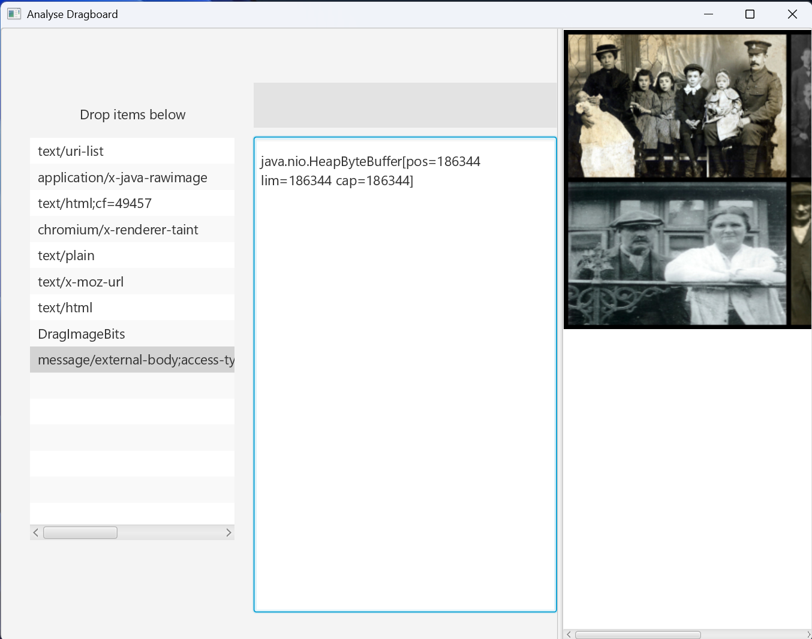
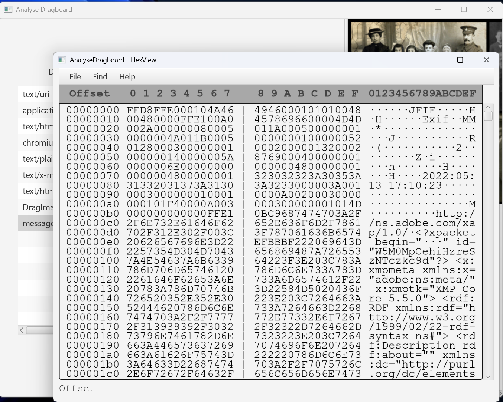

### AnalyseDragboard

Drag anything onto the left pane to see exactly what is available on the JavaFX Dragboard.

It will display HTML, Images or Text for each, I some cases where the buffer does not contain an image and it is too large to be displayed as text, the object descriptor only will be displayed.

A context menu provides the ability to list all characters in a string or the text or object as a hex dump.

Depends on (external libs) DragandDrop2-b4xlib, jHexviewer-b4x, WebP
